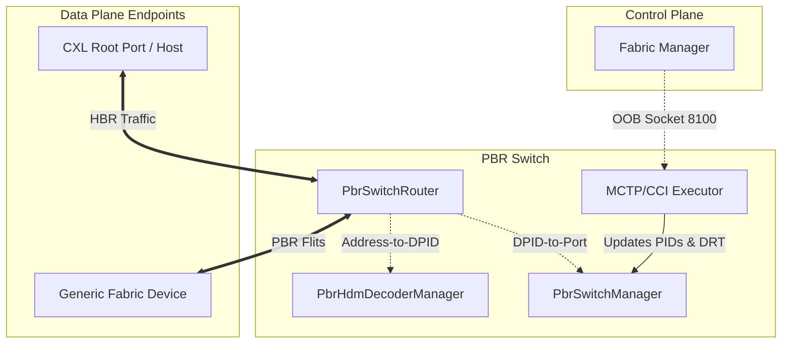
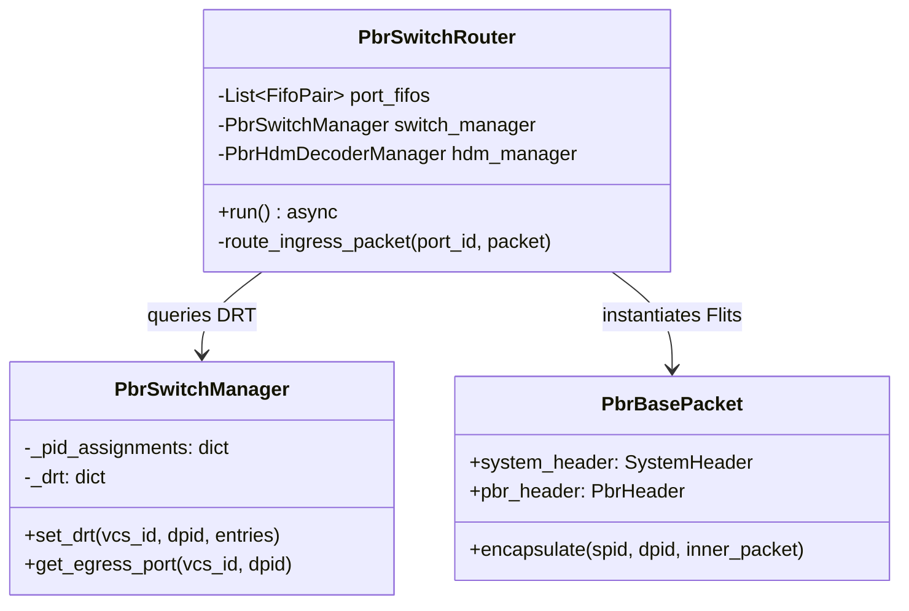
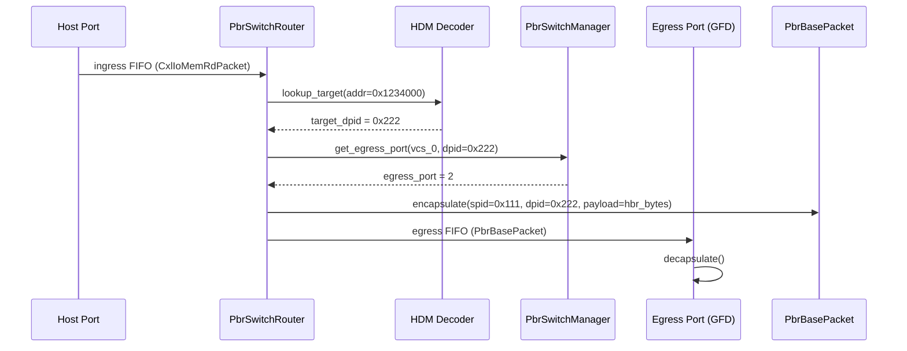

# CXL 4.0 Port-Based Routing (PBR) Design Document

This document outlines the architectural design, control plane management, and data plane encapsulation mechanisms for the Port-Based Routing (PBR) implementation within the OpenCIS Core Simulator.

---

## 1. High-Level Design (HLD)

The High-Level Design focuses on the system boundary, major components, and the separation of the Control Plane (Management) and Data Plane (Packet Routing).

### 1.1 System Architecture Overview

The PBR architecture shifts the routing paradigm from hierarchical address-based PCIe routing (HBR) to an explicit flit-based MAC routing topology using Dynamic Port Identifiers (DPIDs). This allows the CXL Fabric to scale beyond tree topologies into complex, multi-tiered mesh networks.

### 1.2 Core Subsystems
1. **Control Plane (OOB)**: The Fabric Manager connects to the Switch via an Out-of-Band (OOB) MCTP over TCP socket. It issues CXL 3.0+ CCI commands to provision the switch.
2. **State Management**: The `PbrSwitchManager` acts as the source of truth for the switch's forwarding tables (DRT) and Virtual CXL Switch (vCS) topology.
3. **Data Plane**: The `PbrSwitchRouter` actively listens to all connected physical ports, intercepts traffic, and routes it.

---

## 2. Detailed-Level Design (DLD)

The Detailed-Level Design covers the internal class structures, memory representations, state machines, and byte-level encapsulation logic.

### 2.1 State Management & Data Structures
The `PbrSwitchManager` maintains three critical routing dictionaries:
*   **PID Assignments**: Maps `physical_port_id` -> `assigned_pid`.
*   **vCS Bindings**: Maps `assigned_pid` -> `vcs_id` (ensuring isolation between different virtual switches).
*   **Dynamic Routing Table (DRT)**: A nested dictionary mapping `vcs_id` -> `target_dpid` -> `DrtEntry(egress_port, entry_type)`.

The `PbrHdmDecoderManager` maintains an interval tree of `DecoderInfo` objects, mapping a generic `memory_address` to a specific list of `target_dpids` using interleaving math (IG/IW).

### 2.2 Component Class Diagram

### 2.3 Packet Encapsulation Architecture (Byte-Level)

A critical feature of the OpenCIS PBR implementation is the zero-overhead serialization of standard CXL (HBR) packets into 256-byte PBR Flits.

Instead of manually bit-shifting and joining arrays on every transmission, OpenCIS utilizes an auto-generated pure-Python fallback (`packet_structs.py`) powered by `mixin.py`.

*   **`_GenPbrBasePacket`**: Initializes an underlying `bytearray(256)` representing the strict size of a CXL 3.0+ Flit.
*   **`PbrHeader`**: Attached statically at byte offset `2` (following the 2-byte System Header). Getters and setters (e.g., `spid`, `dpid`) read and write directly to the underlying buffer.
*   **Encapsulation**: `PbrBasePacket.encapsulate()` takes raw `bytes(hbr_packet)` and injects them directly into the Flit's data payload section. 

> [!TIP]
> **Performance**: Because the packet properties are strictly bound to byte offsets within a single continuous `bytearray`, calling `bytes(pbr_flit)` requires zero parsing overhead. The raw hex string can be dumped directly into the asyncio transport socket.

### 2.4 End-to-End Routing Lifecycle

---

## 3. Control Plane (Fabric Manager CCI)

The Fabric Manager (FM) provisions the PBR switch out-of-band using standard Component Command Interface (CCI) MCTP packets. The Switch implements these via a Command Dictionary inside `MctpCciExecutor`.

### Implemented Command Set
| Command | Opcode | Description |
| :--- | :--- | :--- |
| **Identify PBR Switch** | `0x5100` | Returns switch capabilities, total DRT entries, and supported vCS count. |
| **Configure PID Assignment** | `0x5101` | Maps a physical port to a Dynamic Port Identifier (DPID). |
| **Configure PID Binding** | `0x5103` | Logically bounds an assigned PID to a Virtual CXL Switch (vCS) for isolated routing. |
| **Set/Get DRT** | `0x5105` / `0x5106` | Programs the switch's forwarding table, mapping a destination DPID to a local physical egress port. |

> [!WARNING]
> **Port Stealing & Transport Hangs**: When testing the FM inside a Docker container, ensure that the mapped `-p 8100:8100` port is not being probed by a Docker proxy daemon. Since `MctpConnectionManager` strictly allows a single TCP connection, external probes will steal the connection, causing the internal switch to hang in a `Waiting Packet` state.

---

## 4. Verification & Traceability

All components of this design are actively verified in the test suite:
*   **Data Plane & Routing**: `test_pbr_data_plane.py`
*   **Encapsulation/Serialization**: `test_pbr_packet_serialization.py`
*   **Control Plane / Commands**: `test_pbr_switch_command_set.py`
*   **Endpoint Integration (GFD)**: `test_gfd_device.py`
