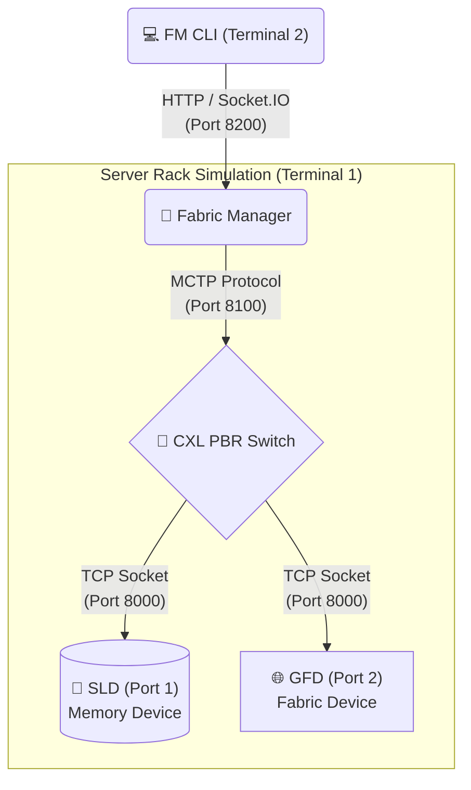

# Generic Fabric Device (GFD) & PBR Flow — Implementation Guide

This document explains the architecture of the **Generic Fabric Device (GFD)** within the OpenCIS CXL 4.0 simulation environment. It is written to be accessible to a layman, explaining the "what" and "why" before diving into the specific code flow of how commands and data actually travel through the system.

---

## 1. The Layman's Introduction

Before diving into code, let's understand the physical metaphor of what we built.

*   **The Switch:** Imagine a network router in your home. Instead of routing internet traffic to laptops and phones, a CXL Switch routes extremely fast memory and data traffic between a Host CPU and PCIe/CXL devices.
*   **PBR (Port-Based Routing):** In older setups, the Host CPU had to manage all the routing. With PBR (a new feature in CXL 4.0), the switch becomes "smart". A central brain programs the switch with numeric IDs (called **PIDs**) and a routing table (called the **DRT**). The switch then automatically routes traffic based on these PIDs.
*   **The Fabric Manager (FM):** This is the "central brain". It sits outside the main data path, configures the switch, assigns PIDs to ports, and programs the routing tables.
*   **The SLD (Single Logical Device):** Think of this as a standard CXL Memory Drive. It holds actual data. In our tests, it is backed by a binary file (`pbr_sld_mem.bin`).
*   **The GFD (Generic Fabric Device):** Think of this as a pure "fabric node". Unlike an SLD, it does not necessarily expose large chunks of memory to the host. It exists simply to participate in the fabric, respond to fabric management commands, and prove that the switch can route traffic to non-memory edge devices.

---

## 2. The Big Picture: Test Environment

When you run `python run_pbr_env.py`, you are simulating an entire physical server rack in a single Python process. Here is how they connect:



---

## 3. How the GFD is Implemented in Code

The GFD is remarkably simple because it doesn't have to manage gigabytes of memory file I/O like the SLD does. It is implemented in three main layers:

### Layer 1: The Application Wrapper (`generic_fabric_device.py`)
This is the entry point. The `GenericFabricDevice` class is responsible for "plugging the cable into the switch". 
*   It creates a `SwitchConnectionClient` which opens a TCP connection to the switch's listening port (default 8000).
*   It tells the switch, *"Hello, I am plugging into Port 2, and I am a Downstream Device."*

### Layer 2: The Device Logic (`cxl_gfd_device.py`)
Once the TCP cable is connected, the `CxlGfdDevice` takes over.
*   It implements the raw CXL protocol (sending and receiving TLPs — Transaction Layer Packets).
*   It handles basic CXL capabilities so that if the switch queries it, it responds as a valid, compliant CXL device.

### Layer 3: The Lack of Memory
Unlike the `SingleLogicalDevice`, the GFD does not instantiate a `MemoryDeviceComponent`. It is a pure protocol engine. In our extended tests, we occasionally substitute the GFD with a second SLD so we can verify that memory writes successfully routed to Port 2 actually reached their destination.

---

## 4. Code Flow: How PBR Control Commands Work

Let's trace exactly what happens when a user types `[3] Assign PID to GFD` in the FM CLI. How does that click turn into switch configuration?

### Step 1: The User Input
In `pbr_fm_cli.py`, the user selects option `3`. The CLI fires an async function:
```python
await cmd_assign_pid(sio, PID_GFD, PORT_GFD, "GFD")
```

### Step 2: Socket.IO to the Fabric Manager
The CLI formats a JSON payload and sends it over the HTTP Socket.IO connection:
```json
// Sent to http://localhost:8200
{
  "operation": 0, 
  "entries": [{"pid": 0x200, "targetId": 2, "instanceId": 0}]
}
```

### Step 3: FM Translates JSON to MCTP Packet
Inside `socketio_server.py`, the Fabric Manager receives the `pbr:configurePid` event. It parses the JSON, and calls the internal API client (`mctp_cci_api_client.py`):
```python
await self._mctp_client.configure_pid_assignment(request_payload)
```
The API client packs this data into raw bytes formatted exactly according to the CXL 4.0 Specification, and sends those bytes over the internal TCP connection (Port 8100) to the switch.

### Step 4: The Switch Executes the Command
Inside the switch (`mctp_cci_executor.py`), the raw bytes arrive. The executor looks at the **Opcode** (which is `5704h` for Configure PID). It finds the registered handler for that opcode: `ConfigurePidAssignmentCommand`.

### Step 5: State is Updated
The command handler extracts the PID (`0x200`) and the Target Port (`2`), and updates the switch's central brain (`PbrSwitchManager`):
```python
self._pbr_switch_manager.assign_pid(pid=0x200, target_id=2)
```
**Result:** The switch now knows that any packet destined for PID `0x200` belongs to the GFD on Port 2.

> [!NOTE]
> This flow is identical for **Set DRT**, which actually programs the routing table. Assigning the PID gives the port a name; Setting the DRT tells the switch how to route to that name.

---

## 5. Code Flow: How Data is Actually Routed

Now that the switch is configured, what happens when we try to write memory to the GFD? Let's trace a memory write from the Host down to the device.

### Step 1: Ingress (Packet Enters the Switch)
The host sends a standard PCIe memory write (HBR TLP) to the switch's upstream port (Port 0). 
```python
# The packet arrives at the switch's router engine
_route_packet(ingress_port=0, packet)
```

### Step 2: Address translation (HDM Decoder)
The switch looks at the memory address the host is trying to write to (e.g., `0x1500`). It asks the `PbrHdmDecoderManager`: *"Which PID owns this memory address?"*
The decoder replies: *"Address 0x1500 belongs to DPID `0x200`."*

### Step 3: PBR Encapsulation
The router realizes this is a standard packet that needs to traverse a PBR fabric. It wraps the original packet inside a new **PBR Header**:
```python
pbr_packet = PbrBasePacket.encapsulate(
    spid=0,           # Source PID (the Host)
    dpid=0x200,       # Destination PID (the GFD)
    inner_packet=pkt
)
```

### Step 4: DRT Lookup (The Routing Decision)
Now the router has a packet with `dpid=0x200`. It asks the `PbrSwitchManager` to look up `0x200` in the **DPID Routing Table (DRT)**:
```python
drt_entry = pbr_manager.get_drt(dpid=0x200)
# Returns: DrtEntry(type=PHYSICAL_PORT, target=2)
```

### Step 5: Egress to the GFD
The router now knows exactly where to send it. It takes the packet, removes the PBR Header (decapsulation), and places the original memory write packet onto the outgoing queue for Port 2. 
The TCP socket transmits the bytes, and the GFD receives the memory write!

---

## Summary

The magic of PBR is that it decouples the **Host** from the **Topology**. 
1. The **FM** acts as the omniscient brain, using Socket.IO and MCTP commands to program routing maps (DRT) into the switch.
2. The **Switch** acts as an ultra-fast mail sorter, simply looking at DPIDs and forwarding packets to the correct physical port.
3. The **GFD/SLD** just sit at the end of the wire, completely unaware of the complex routing that got the packet to their front door. They just process the data they receive.
