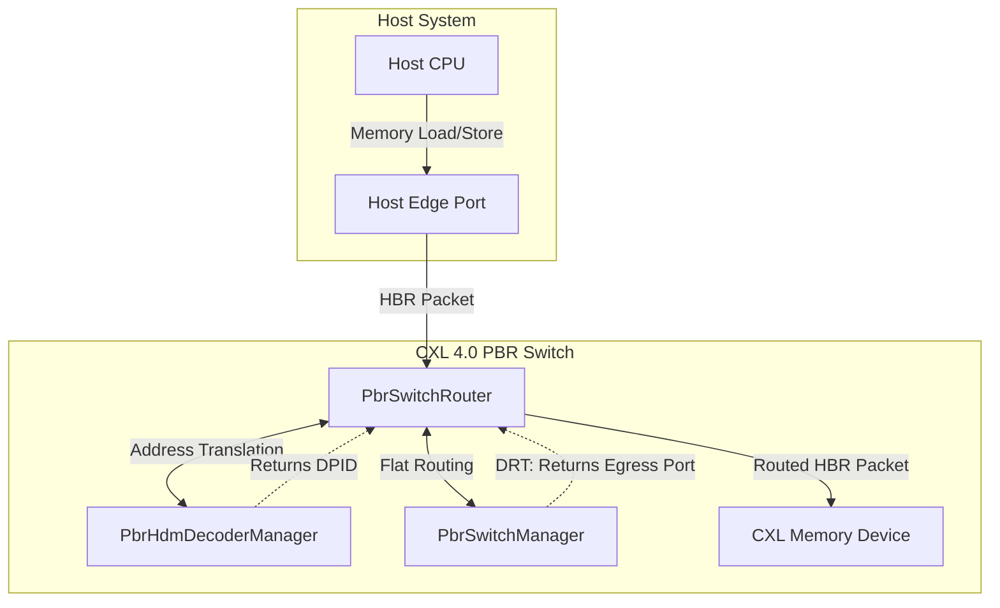
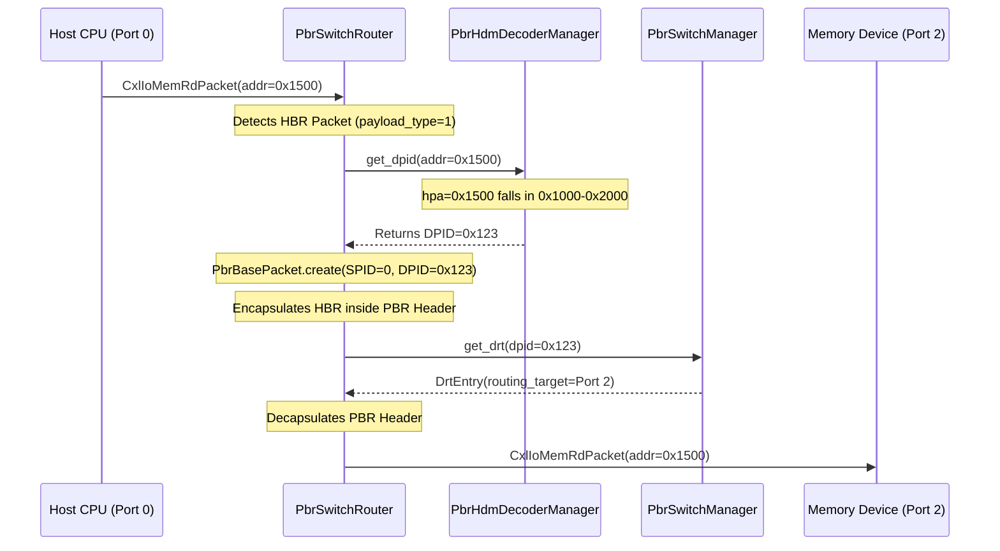

# CXL 4.0 Port-Based Routing (PBR) System Design & Flow

This document details the exhaustive architectural design, code execution flow, packet lifecycle, and testing mechanisms for the end-to-end Port-Based Routing (PBR) Data Plane implemented in the `opencis-core` CXL simulator.

---

## 1. Background: Why Port-Based Routing?

In standard CXL 2.0/3.0 **Hierarchical Routing**, switches rely on multiple Virtual PCI-to-PCI Bridges (vPPBs) grouped inside a Virtual CXL Switch (VCS). At every switch hop, the physical memory address (HPA) must be decoded via HDM Decoders to determine the downstream path. This architecture inherently forms a tree topology, scaling poorly in massive fabric deployments like AI/ML clusters, and struggling with complex peer-to-peer topologies.

**CXL 4.0 Port-Based Routing (PBR)** introduces "Flat Routing". Instead of routing hierarchically via addresses at every switch hop:
1. The **Ingress Edge Port** (where traffic enters the PBR fabric) translates the physical address into a 12-bit **Destination PID (DPID)**.
2. The packet is encapsulated into a standard PBR wrapper containing both the Source PID (SPID) and DPID.
3. Every switch in the fabric uses a flat **DPID Routing Table (DRT)** to immediately locate the target physical egress port.
4. The **Egress Edge Port** decapsulates the packet and delivers the standard CXL request to the target device.

---

## 2. System Architecture & Components

The implementation introduces four entirely new sub-systems to `opencis-core`, decoupling PBR logic from legacy hierarchical vPPB components.



### 2.1. `PbrSwitchManager` (Control Plane)
The PBR Switch Manager acts as the "Brain" of the fabric configuration. It exposes the CXL 4.0 Fabric Management API (CCI) to allow an external Fabric Manager (FM) to provision the fabric.

* **CCI Command Set (5700h - 5709h)**: Implements operations like `Get/Set PID Binding`, `Identify PBR Switch`, and `Get/Set DRT`.
* **DPID Routing Table (DRT)**: Maintains 4,096 `DrtEntry` records. Each entry maps a `DPID` to a `routing_target` (a physical port index) based on an `entry_type` (e.g., `PHYSICAL_PORT` or `RGT_INDEX`).
* **PID Bindings**: Maintains the mapping between virtual hierarchical connections (VCS/vPPB) and their physical PID counterparts for edge-fabric stitching.

### 2.2. `PbrHdmDecoderManager` (Ingress Edge Address Translation)
Extends the simulator's HDM framework (`HdmDecoderBase`).
* **Purpose**: Instead of mapping an HPA range to a downstream switch port, it maps it to a **DPID**. This bridges the gap between traditional Host memory accesses and PBR fabric routing.
* **Interleaving Math**: The decoder handles `INTERLEAVE_GRANULARITY` (IG) and `INTERLEAVE_WAYS` (IW). When an address enters, the manager computes: `target_index = (hpa // decoded_ig) % decoded_iw`. It then uses this index to fetch the exact `DPID` from the `target_dpids` array.

### 2.3. `PbrBasePacket` (Transport Encapsulation)
Defines the physical representation of a PBR Flit on the wire.
* Introduces a new `PAYLOAD_TYPE.PBR` enum.
* Houses the `PbrHeader`, structurally defined as a 32-bit field containing:
  * `DPID`: 12 bits
  * `SPID`: 12 bits
  * `Reserved`: 8 bits
* The inner standard CXL TLP (e.g., `CxlIoMemRdPacket`) is dynamically injected into the `.inner_payload` field, exactly reflecting the byte-level encapsulation defined by the CXL specification.

### 2.4. `PbrSwitchRouter` (Data Plane)
The asynchronous data path engine. It runs continuous background tasks (`AsyncGatherer`) to process packets from every physical port FIFO.
* **Ingress Interception**: Identifies whether incoming traffic is standard HBR or encapsulated PBR.
* **Ingress Encapsulation**: Uses the `PbrHdmDecoderManager` to extract addresses, calculate DPIDs, and package raw HBR packets into `PbrBasePacket`s.
* **Flat Routing**: Queries the `PbrSwitchManager`'s DRT for the egress port.
* **Egress Decapsulation**: Strips the PBR header and pushes the original HBR packet into the destination port's queue.

---

## 3. Exhaustive Packet Lifecycle & Code Flow

When a simulated CXL Host CPU sends a memory read request to a CXL memory device across the PBR switch, the execution flow strictly follows this path:



1. **Host Injects Packet**: A raw `CxlIoMemRdPacket(addr=0x1500)` enters `Port 0`'s `target_to_host` FIFO.
2. **Ingress Identification (`pbr_switch_router._route_packet`)**: The Router pulls the packet from the FIFO. It calls `base_packet.is_pbr()` which evaluates to `False`. The router recognizes this as an Ingress Edge Port event.
3. **HDM Address Extraction**: The router inspects the `CxlIoMemRdPacket` object and extracts the physical address (`0x1500`).
4. **HDM Address Translation (`PbrHdmDecoderManager.get_dpid`)**: 
   * The router passes `0x1500` to the Decoder Manager.
   * The manager identifies that `0x1500` falls within a committed decoder mapping `0x1000 - 0x2000`.
   * Based on interleave settings, it returns the target: `DPID 0x123`.
5. **Encapsulation (`PbrBasePacket.create`)**: The router instantiates a new `PbrBasePacket` (`payload_type=5`). It sets `DPID=0x123` and `SPID=0x0` (the ingress port's bound PID). The original memory read packet is serialized into the inner payload.
6. **Re-Routing**: The router recursively passes the newly encapsulated `PbrBasePacket` back into its own routing loop.
7. **Flat Routing (`pbr_switch_manager.get_drt`)**: 
   * This time, `is_pbr()` evaluates to `True`.
   * The Router extracts `DPID=0x123` and queries the DRT at index `0x123`.
   * The DRT returns `DrtEntry(entry_type=1, routing_target=2)`.
8. **Egress & Decapsulation**:
   * The router targets `port_fifos[2]`.
   * It calls `pbr_packet.get_inner_packet()` to strip the PBR wrapper.
   * The raw `CxlIoMemRdPacket` is safely placed into `Port 2`'s `host_to_target` FIFO.
9. **Endpoint Delivery**: The connected CXL Endpoint at Port 2 dequeues the standard memory request and begins processing.

---

## 4. Testing & Validation

### Execution Command
To mathematically verify the end-to-end Data Plane routing, execute the following `pytest` command. The `-v` flag enables verbosity, `-s` ensures standard output isn't captured, and `--log-cli-level=DEBUG` prints the internal `opencis_logger` traces.

```bash
python -m pytest tests/test_pbr_data_plane.py -v -s --log-cli-level=DEBUG
```

### Annotated Log Trace
The logs generated during `test_pbr_end_to_end_address_routing` reveal exactly how the simulator components interact in real-time.

```text
============================= test session starts =============================
platform win32 -- Python 3.11.9
...
tests/test_pbr_data_plane.py::test_pbr_end_to_end_address_routing 
```
*The Test Harness boots up the `PbrSwitchManager`, `PbrSwitchRouter`, and `PbrHdmDecoderManager`.*

```text
[PbrSwitchManager] set_drt: wrote 1 entries to DRT[0] starting at DPID 0x123
```
*The Control Plane is provisioned. `DPID 0x123` is mapped to Physical Port 2.*

```text
[PbrHdmDecoderManager] [Decoder Commit] index: 0, base: 0x1000, size: 0x1000, ig: SIZE_256B, iw: WAY_1, target dpids: [291]
```
*The HDM Address Decoder is provisioned. Memory range `0x1000 - 0x2000` is mapped to target DPID 291 (`0x123` in hexadecimal).*

```text
[PbrSwitchRouter:Switch0] Not running yet. Waiting
[PbrSwitchRouter:Switch0] Starting
```
*The `AsyncGatherer` background tasks initialize and the router begins listening on all FIFOs.*

```text
[PbrSwitchRouter:Switch0] Checking packet type: is_pbr=False payload_type=1
[PbrSwitchRouter:Switch0] Received HBR packet on port 0
```
*The Test Harness injects `CxlIoMemRdPacket` into Port 0. The router intercepts it and verifies it is a standard `HBR` memory request (`payload_type=1`).*

```text
decoder.index:0, decoder.base:1000decoder.size:1000, decoder.ig/iw:0/0
[PbrSwitchRouter:Switch0] Encapsulating HBR packet to DPID=0x123
```
*The HDM Decoder successfully matches the address `0x1500` against decoder index 0. The router creates the `PbrBasePacket` wrapper with `DPID 0x123`.*

```text
[PbrSwitchRouter:Switch0] Checking packet type: is_pbr=True payload_type=5
[PbrSwitchRouter:Switch0] Received PBR Packet: SPID=0x0, DPID=0x123
```
*The router processes the newly encapsulated packet. It detects `payload_type=5` (PBR) and reads the Routing Header.*

```text
[PbrSwitchRouter:Switch0] Routing DPID=0x123 to port 2
[PbrSwitchRouter:Switch0] Decapsulated PBR packet, forwarding CxlIoMemRdPacket to port 2
```
*The router queries the DRT, finds `Port 2`, strips the PBR header, and injects the inner `CxlIoMemRdPacket` into the destination FIFO.*

```text
[PbrSwitchRouter:Switch0] Stopping
[PbrSwitchRouter:Switch0] Stopped
PASSED

============================== 2 passed in 0.15s ==============================
```
*The Test Harness detects the `CxlIoMemRdPacket` emerging from Port 2's FIFO, verifies its data integrity, shuts down the router, and passes the test.*

---

## 5. Implementation Change Statistics

Below is the summary of the exact files created and modified, along with line insertion statistics representing the full scale of the CXL 4.0 PBR implementation.

**Total Changes:** 18 files changed, 2,699 insertions.

### New Components Created
```text
 opencis/cxl/cci/fabric_manager/pbr_switch/__init__.py                |  34 ++
 opencis/cxl/cci/fabric_manager/pbr_switch/configure_pid_assignment.py| 151 +++++
 opencis/cxl/cci/fabric_manager/pbr_switch/configure_pid_binding.py   | 164 ++++++
 opencis/cxl/cci/fabric_manager/pbr_switch/get_drt.py                 | 186 +++++++
 opencis/cxl/cci/fabric_manager/pbr_switch/get_pid_binding.py         | 155 ++++++
 opencis/cxl/cci/fabric_manager/pbr_switch/identify_pbr_switch.py     | 116 ++++
 opencis/cxl/cci/fabric_manager/pbr_switch/set_drt.py                 | 122 ++++
 opencis/cxl/component/pbr_switch_manager.py                          | 401 +++++++++++++
 opencis/cxl/component/pbr_switch_router.py                           | 164 ++++++
 tests/test_pbr_data_plane.py                                         | 137 +++++
 tests/test_pbr_switch_command_set.py                                 | 619 +++++++++++++++++++++
```

### Existing Files Modified
```text
 opencis/cxl/cci/common.py                                            |  26 +
 opencis/cxl/component/fabric_manager/socketio_server.py              | 174 ++++++
 opencis/cxl/component/hdm_decoder.py                                 |  57 ++
 opencis/cxl/component/mctp/mctp_cci_api_client.py                    | 122 ++++
 opencis/cxl/component/packet_reader.py                               |   9 +
 opencis/cxl/transport/common.py                                      |   4 +
 opencis/cxl/transport/transaction.py                                 |  58 ++
```
